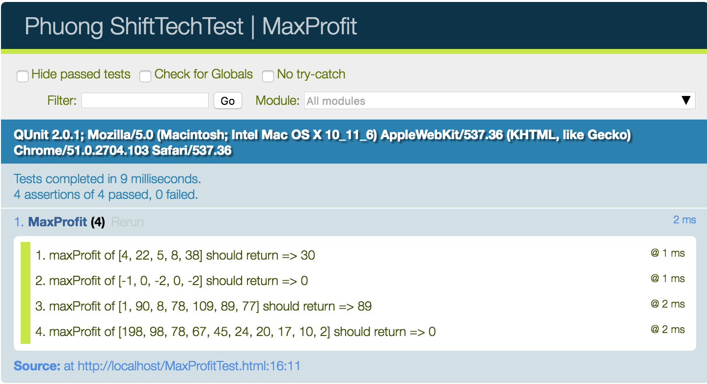

# [**MaxProfitr**](MaxProfit.js)

## [**Problem Statement**](MaxProfit.js)

 With an array which represents monthly sales as parameter,
 create a function maxProfit that returns the highest profit from a month sale to the next one

 e.g [4, 22, 5, 8, 38] returns => 30

 if there is no profit or the profit is negative return 0

**Definition**

| Class | Method | Parameters | Returns |   
|---|:---:|:---:|:---:|
|MaxProfit | calculate | [int] | int |

**Run Unit Test**

Simply just open the [MaxProfitTest.html](MaxProfitTest.html) in your browser.

